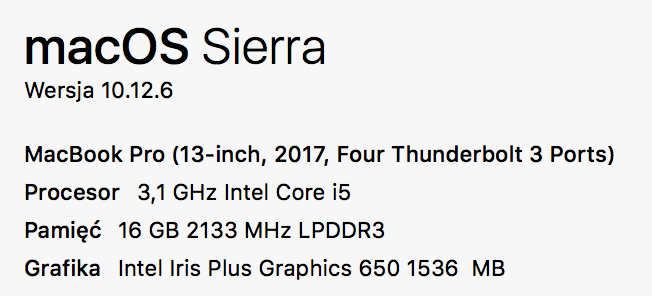

## Dane źródłowe

*Baza hipermarketów i sklepów na świecie*

### Struktura:

* name - nazwa sklepu
* street - ulica
* city - miasto
* country - kraj
* lat, lon - dane geolokalizacyjne
* area - powierzchnia sklepu

### Dane wielkościowe

* Ilość rekordów - 2 miliony
* Przed spakowaniem - 298 MB
* Po spakowaniu - 68 MB

### Link

https://drive.google.com/file/d/1C77wNGBP31aqwRqsyfSmIjzDsPNoXvgB/view?usp=sharing

# Zadanie 1 - Moje dane

Zadaniem było zaimportowanie dużej bazy danych w formacie JSON do bazy danych MongoDB w różnych wersjach:

1. Standalone
2. ReplicaSet localhost
    1. domyślnych (należy sprawdzić jakie to są ustawienia)
    2. w: 1, j: false
    3. w: 1, j: true
    4. w: 2, j: false
    5. w: 2, j: true

3. ReplicaSet na innych komputerach (w laboratorium)

## Parametry komputera

Zadanie wykonałem przy użyciu komputera MacBook Pro o następujących parametrach:




## Standalone

### Metodologia

Sprawdziłem import zarówno bezpośrednio z pliku JSON jak i na bieżąco przez `unzip`

1. `mongoimport -d markets -c markets1 --file dataset.json --jsonArray`
2. `unzip dataset.json.zip | mongoimport -d markets -c markets2 --file dataset.json --jsonArray`

### Wyniki

```
time mongoimport -d markets -c markets1 --file dataset.json --jsonArray
2018-03-14T23:03:00.059+0100  connected to: localhost
2018-03-14T23:03:03.023+0100  [###.....................] markets.markets1 38.7MB/284MB (13.6%)
2018-03-14T23:03:06.026+0100  [######..................] markets.markets1 75.8MB/284MB (26.7%)
2018-03-14T23:03:09.023+0100  [#########...............] markets.markets1 115MB/284MB (40.4%)
2018-03-14T23:03:12.023+0100  [############............] markets.markets1 153MB/284MB (54.0%)
2018-03-14T23:03:15.026+0100  [###############.........] markets.markets1 188MB/284MB (66.4%)
2018-03-14T23:03:18.023+0100  [###################.....] markets.markets1 231MB/284MB (81.3%)
2018-03-14T23:03:21.026+0100  [######################..] markets.markets1 271MB/284MB (95.3%)
2018-03-14T23:03:22.065+0100  [########################] markets.markets1 284MB/284MB (100.0%)
2018-03-14T23:03:22.065+0100  imported 2000000 documents


mongoimport -d markets -c markets1 --file dataset.json --jsonArray  26,48s user 1,59s system 127% cpu 22,069 total


➜  nosql git:(dataset) ✗ time unzip dataset.json.zip | mongoimport -d markets -c markets2 --file dataset.json --jsonArray
2018-03-14T23:03:48.731+0100  connected to: localhost
2018-03-14T23:03:51.723+0100  [########################] markets.markets2 31.8MB/7.50MB (423.9%)
2018-03-14T23:03:54.722+0100  [########################] markets.markets2 64.5MB/7.50MB (859.4%)
2018-03-14T23:03:57.722+0100  [########################] markets.markets2 99.3MB/7.50MB (1323.5%)
2018-03-14T23:04:00.722+0100  [########################] markets.markets2 134MB/7.50MB (1782.8%)
2018-03-14T23:04:03.726+0100  [########################] markets.markets2 167MB/7.50MB (2224.1%)
2018-03-14T23:04:06.723+0100  [########################] markets.markets2 202MB/7.50MB (2689.7%)
2018-03-14T23:04:09.726+0100  [########################] markets.markets2 237MB/7.50MB (3164.8%)
2018-03-14T23:04:12.723+0100  [########################] markets.markets2 273MB/7.50MB (3640.0%)
2018-03-14T23:04:13.597+0100  [########################] markets.markets2 284MB/7.50MB (3785.7%)
2018-03-14T23:04:13.597+0100  imported 2000000 documents


unzip dataset.json.zip  1,66s user 0,25s system 62% cpu 3,041 total
mongoimport -d markets -c markets2 --file dataset.json --jsonArray  26,50s user 1,55s system 112% cpu 24,937 total
```

## ReplicaSet w: 1, j: true (domyślnie)

### Metodologia

Uruchamiam ReplicaSet poleceniem:

`mongod --port 27001
        --replSet mongo-replset
        --dbpath ~/mongo-replset/data-1
        --bind_ip localhost`

`mongod --port 27002
--replSet mongo-replset
--dbpath ~/mongo-replset/data-2
--bind_ip localhost`

`mongod --port 27003
--replSet mongo-replset
--dbpath ~/mongo-replset/data-3
--bind_ip localhost`

Następnie skonfigurowałem zbiór ReplicaSet poprzez wejście na pierwszy host i podanie hasha konfiguracyjnego.

Następnie uruchomiłem import następującą komendą:

`unzip dataset.json.zip | mongoimport --host mongo-replset/localhost:27001,localhost:27002,localhost:27003 -d markets -c markets10 --writeConcern 1 --jsonArray`

### Wyniki

```
2018-03-16T09:36:46.345+0100  connected to: mongo-replset/localhost:27001,localhost:27002,localhost:27003
2018-03-16T09:36:49.343+0100  [########################] markets.markets10  9.30MB/2.13MB (437.9%)
2018-03-16T09:36:52.342+0100  [########################] markets.markets10  18.5MB/2.13MB (868.5%)
2018-03-16T09:36:55.341+0100  [########################] markets.markets10  27.0MB/2.13MB (1271.5%)
2018-03-16T09:36:58.340+0100  [########################] markets.markets10  36.1MB/2.13MB (1696.9%)
2018-03-16T09:37:01.341+0100  [########################] markets.markets10  44.4MB/2.13MB (2091.0%)
2018-03-16T09:37:04.341+0100  [########################] markets.markets10  52.0MB/2.13MB (2445.1%)
2018-03-16T09:37:07.340+0100  [########################] markets.markets10  62.9MB/2.13MB (2959.7%)
2018-03-16T09:37:10.341+0100  [########################] markets.markets10  74.3MB/2.13MB (3494.4%)
2018-03-16T09:37:13.340+0100  [########################] markets.markets10  86.0MB/2.13MB (4048.7%)
2018-03-16T09:37:16.344+0100  [########################] markets.markets10  97.5MB/2.13MB (4589.9%)
2018-03-16T09:37:19.344+0100  [########################] markets.markets10  109MB/2.13MB (5138.0%)
2018-03-16T09:37:22.342+0100  [########################] markets.markets10  122MB/2.13MB (5752.3%)
2018-03-16T09:37:25.341+0100  [########################] markets.markets10  133MB/2.13MB (6254.4%)
2018-03-16T09:37:28.341+0100  [########################] markets.markets10  146MB/2.13MB (6861.1%)
2018-03-16T09:37:31.341+0100  [########################] markets.markets10  156MB/2.13MB (7328.8%)
2018-03-16T09:37:34.341+0100  [########################] markets.markets10  166MB/2.13MB (7816.5%)
2018-03-16T09:37:37.341+0100  [########################] markets.markets10  178MB/2.13MB (8371.0%)
2018-03-16T09:37:40.343+0100  [########################] markets.markets10  190MB/2.13MB (8957.1%)
2018-03-16T09:37:43.342+0100  [########################] markets.markets10  201MB/2.13MB (9453.1%)
2018-03-16T09:37:46.344+0100  [########################] markets.markets10  211MB/2.13MB (9927.4%)
2018-03-16T09:37:49.341+0100  [########################] markets.markets10  223MB/2.13MB (10515.2%)
2018-03-16T09:37:52.343+0100  [########################] markets.markets10  237MB/2.13MB (11129.8%)
2018-03-16T09:37:55.347+0100  [########################] markets.markets10  249MB/2.13MB (11698.0%)
2018-03-16T09:37:58.341+0100  [########################] markets.markets10  261MB/2.13MB (12292.6%)
2018-03-16T09:38:01.342+0100  [########################] markets.markets10  271MB/2.13MB (12760.3%)
2018-03-16T09:38:04.342+0100  [########################] markets.markets10  282MB/2.13MB (13268.1%)
2018-03-16T09:38:04.859+0100  [########################] markets.markets10  284MB/2.13MB (13361.3%)
2018-03-16T09:38:04.860+0100  imported 2000000 documents
```


## ReplicaSet w: 1, j: false

Metodologia analogicznie:

```
connected to: mongo-replset/localhost:27001,localhost:27002,localhost:27003
2018-03-16T09:40:48.663+0100  [##......................] markets.markets11  26.3MB/284MB (9.3%)
2018-03-16T09:40:51.661+0100  [###.....................] markets.markets11  37.3MB/284MB (13.1%)
2018-03-16T09:40:54.664+0100  [####....................] markets.markets11  51.1MB/284MB (18.0%)
2018-03-16T09:40:57.664+0100  [#####...................] markets.markets11  64.5MB/284MB (22.7%)
2018-03-16T09:41:00.663+0100  [######..................] markets.markets11  77.8MB/284MB (27.4%)
2018-03-16T09:41:03.661+0100  [#######.................] markets.markets11  88.6MB/284MB (31.2%)
2018-03-16T09:41:06.663+0100  [########................] markets.markets11  100MB/284MB (35.3%)
2018-03-16T09:41:09.664+0100  [#########...............] markets.markets11  112MB/284MB (39.4%)
2018-03-16T09:41:12.663+0100  [##########..............] markets.markets11  125MB/284MB (43.9%)
2018-03-16T09:41:15.662+0100  [###########.............] markets.markets11  137MB/284MB (48.2%)
2018-03-16T09:41:18.662+0100  [############............] markets.markets11  149MB/284MB (52.6%)
2018-03-16T09:41:21.666+0100  [#############...........] markets.markets11  162MB/284MB (57.0%)
2018-03-16T09:41:24.662+0100  [##############..........] markets.markets11  172MB/284MB (60.6%)
2018-03-16T09:41:27.664+0100  [###############.........] markets.markets11  185MB/284MB (65.1%)
2018-03-16T09:41:30.665+0100  [################........] markets.markets11  198MB/284MB (69.7%)
2018-03-16T09:41:33.662+0100  [#################.......] markets.markets11  211MB/284MB (74.3%)
2018-03-16T09:41:36.664+0100  [##################......] markets.markets11  223MB/284MB (78.6%)
2018-03-16T09:41:39.662+0100  [###################.....] markets.markets11  235MB/284MB (82.7%)
2018-03-16T09:41:42.666+0100  [####################....] markets.markets11  246MB/284MB (86.6%)
2018-03-16T09:41:45.662+0100  [#####################...] markets.markets11  258MB/284MB (90.8%)
2018-03-16T09:41:48.663+0100  [######################..] markets.markets11  270MB/284MB (95.0%)
2018-03-16T09:41:51.663+0100  [#######################.] markets.markets11  283MB/284MB (99.6%)
2018-03-16T09:41:51.998+0100  [########################] markets.markets11  284MB/284MB (100.0%)
2018-03-16T09:41:51.998+0100  imported 2000000 documents
```

## ReplicaSet w: 2, j: true

```
connected to: mongo-replset/localhost:27001,localhost:27002,localhost:27003
2018-03-16T09:42:53.394+0100  [##......................] markets.markets12  32.8MB/284MB (11.6%)
2018-03-16T09:42:56.393+0100  [####....................] markets.markets12  56.2MB/284MB (19.8%)
2018-03-16T09:42:59.393+0100  [#####...................] markets.markets12  65.7MB/284MB (23.1%)
2018-03-16T09:43:02.393+0100  [######..................] markets.markets12  73.8MB/284MB (26.0%)
2018-03-16T09:43:05.394+0100  [#######.................] markets.markets12  85.0MB/284MB (30.0%)
2018-03-16T09:43:08.397+0100  [#######.................] markets.markets12  94.3MB/284MB (33.2%)
2018-03-16T09:43:11.393+0100  [########................] markets.markets12  106MB/284MB (37.4%)
2018-03-16T09:43:14.397+0100  [#########...............] markets.markets12  118MB/284MB (41.4%)
2018-03-16T09:43:17.395+0100  [##########..............] markets.markets12  128MB/284MB (45.1%)
2018-03-16T09:43:20.396+0100  [###########.............] markets.markets12  139MB/284MB (48.9%)
2018-03-16T09:43:23.393+0100  [############............] markets.markets12  152MB/284MB (53.6%)
2018-03-16T09:43:26.393+0100  [#############...........] markets.markets12  165MB/284MB (58.0%)
2018-03-16T09:43:29.393+0100  [##############..........] markets.markets12  177MB/284MB (62.2%)
2018-03-16T09:43:32.395+0100  [###############.........] markets.markets12  188MB/284MB (66.2%)
2018-03-16T09:43:35.396+0100  [################........] markets.markets12  201MB/284MB (70.7%)
2018-03-16T09:43:38.393+0100  [#################.......] markets.markets12  213MB/284MB (74.9%)
2018-03-16T09:43:41.396+0100  [###################.....] markets.markets12  226MB/284MB (79.4%)
2018-03-16T09:43:44.393+0100  [####################....] markets.markets12  238MB/284MB (84.0%)
2018-03-16T09:43:47.397+0100  [#####################...] markets.markets12  251MB/284MB (88.4%)
2018-03-16T09:43:50.393+0100  [######################..] markets.markets12  264MB/284MB (92.9%)
2018-03-16T09:43:53.394+0100  [#######################.] markets.markets12  276MB/284MB (97.2%)
2018-03-16T09:43:55.094+0100  [########################] markets.markets12  284MB/284MB (100.0%)
2018-03-16T09:43:55.094+0100  imported 2000000 documents
```

## ReplicaSet w: 2, j: false

```
connected to: mongo-replset/localhost:27001,localhost:27002,localhost:27003
2018-03-16T09:44:33.902+0100  [#.......................] markets.markets13  21.4MB/284MB (7.5%)
2018-03-16T09:44:36.900+0100  [##......................] markets.markets13  33.9MB/284MB (12.0%)
2018-03-16T09:44:39.900+0100  [####....................] markets.markets13  47.7MB/284MB (16.8%)
2018-03-16T09:44:42.900+0100  [#####...................] markets.markets13  61.0MB/284MB (21.5%)
2018-03-16T09:44:45.902+0100  [######..................] markets.markets13  74.4MB/284MB (26.2%)
2018-03-16T09:44:48.900+0100  [#######.................] markets.markets13  86.8MB/284MB (30.6%)
2018-03-16T09:44:51.900+0100  [########................] markets.markets13  97.0MB/284MB (34.2%)
2018-03-16T09:44:54.900+0100  [#########...............] markets.markets13  110MB/284MB (38.6%)
2018-03-16T09:44:57.900+0100  [##########..............] markets.markets13  122MB/284MB (42.9%)
2018-03-16T09:45:00.903+0100  [###########.............] markets.markets13  134MB/284MB (47.3%)
2018-03-16T09:45:03.900+0100  [############............] markets.markets13  146MB/284MB (51.4%)
2018-03-16T09:45:06.903+0100  [#############...........] markets.markets13  158MB/284MB (55.7%)
2018-03-16T09:45:09.900+0100  [##############..........] markets.markets13  169MB/284MB (59.4%)
2018-03-16T09:45:12.900+0100  [###############.........] markets.markets13  181MB/284MB (63.6%)
2018-03-16T09:45:15.902+0100  [################........] markets.markets13  192MB/284MB (67.7%)
2018-03-16T09:45:18.900+0100  [#################.......] markets.markets13  205MB/284MB (72.3%)
2018-03-16T09:45:21.903+0100  [##################......] markets.markets13  217MB/284MB (76.4%)
2018-03-16T09:45:24.902+0100  [###################.....] markets.markets13  226MB/284MB (79.7%)
2018-03-16T09:45:27.903+0100  [###################.....] markets.markets13  235MB/284MB (82.7%)
2018-03-16T09:45:30.903+0100  [####################....] markets.markets13  247MB/284MB (87.1%)
2018-03-16T09:45:33.901+0100  [#####################...] markets.markets13  257MB/284MB (90.6%)
2018-03-16T09:45:36.905+0100  [######################..] markets.markets13  269MB/284MB (94.7%)
2018-03-16T09:45:39.902+0100  [#######################.] markets.markets13  282MB/284MB (99.3%)
2018-03-16T09:45:40.371+0100  [########################] markets.markets13  284MB/284MB (100.0%)
2018-03-16T09:45:40.371+0100  imported 2000000 documents
```

## Wzorcowe punkty adresowe województwo mazowieckie

Aby oszacować różnice w czasach importu, zaimportuję też bazę danych punktów adresowych województwa mazowieckiego

# Tabela wyników

| Kolekcja  | Tryb        | Wielkość kolekcji | Średni Czas importu |
|-----------|-------------|-------------------|---------------------|
| Markets   | Standalone  | 2 000 000         | 25,12s              |
| Markets   | W: 1, J: 1  | 2 000 000         | 1 min 12s.          |
| Markets   | W: 1, J: 0  | 2 000 000         | 1 min 5s.           |
| Markets   | W: 2, J: 1  | 2 000 000         | 1 min 2s:30         |
| Markets   | W: 2, J: 0  | 2 000 000         | 1 min 8s.           |
| PktAddr   | W: 1, J: 1  | ok 300 000        | 14s                 |


