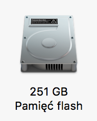

# Zadanie 1 - Moje dane

Zadaniem było zaimportowanie dużej bazy danych w formacie JSON do bazy danych MongoDB w różnych wersjach:

1. Standalone
2. ReplicaSet localhost
    1. domyślnych (należy sprawdzić jakie to są ustawienia)
    2. w: 1, j: false
    3. w: 1, j: true
    4. w: 2, j: false
    5. w: 2, j: true

3. ReplicaSet na innych komputerach (w laboratorium)

## Parametry komputera

Zadanie wykonałem przy użyciu komputera MacBook Pro o następujących parametrach:




## Standalone

### Metodologia

Sprawdziłem import zarówno bezpośrednio z pliku JSON jak i na bieżąco przez `unzip`

1. `mongoimport -d markets -c markets1 --file dataset.json --jsonArray`
2. `unzip dataset.json.zip | mongoimport -d markets -c markets2 --file dataset.json --jsonArray`

### Wyniki

```
time mongoimport -d markets -c markets1 --file dataset.json --jsonArray
2018-03-14T23:03:00.059+0100  connected to: localhost
2018-03-14T23:03:03.023+0100  [###.....................] markets.markets1 38.7MB/284MB (13.6%)
2018-03-14T23:03:06.026+0100  [######..................] markets.markets1 75.8MB/284MB (26.7%)
2018-03-14T23:03:09.023+0100  [#########...............] markets.markets1 115MB/284MB (40.4%)
2018-03-14T23:03:12.023+0100  [############............] markets.markets1 153MB/284MB (54.0%)
2018-03-14T23:03:15.026+0100  [###############.........] markets.markets1 188MB/284MB (66.4%)
2018-03-14T23:03:18.023+0100  [###################.....] markets.markets1 231MB/284MB (81.3%)
2018-03-14T23:03:21.026+0100  [######################..] markets.markets1 271MB/284MB (95.3%)
2018-03-14T23:03:22.065+0100  [########################] markets.markets1 284MB/284MB (100.0%)
2018-03-14T23:03:22.065+0100  imported 2000000 documents


mongoimport -d markets -c markets1 --file dataset.json --jsonArray  26,48s user 1,59s system 127% cpu 22,069 total


➜  nosql git:(dataset) ✗ time unzip dataset.json.zip | mongoimport -d markets -c markets2 --file dataset.json --jsonArray
2018-03-14T23:03:48.731+0100  connected to: localhost
2018-03-14T23:03:51.723+0100  [########################] markets.markets2 31.8MB/7.50MB (423.9%)
2018-03-14T23:03:54.722+0100  [########################] markets.markets2 64.5MB/7.50MB (859.4%)
2018-03-14T23:03:57.722+0100  [########################] markets.markets2 99.3MB/7.50MB (1323.5%)
2018-03-14T23:04:00.722+0100  [########################] markets.markets2 134MB/7.50MB (1782.8%)
2018-03-14T23:04:03.726+0100  [########################] markets.markets2 167MB/7.50MB (2224.1%)
2018-03-14T23:04:06.723+0100  [########################] markets.markets2 202MB/7.50MB (2689.7%)
2018-03-14T23:04:09.726+0100  [########################] markets.markets2 237MB/7.50MB (3164.8%)
2018-03-14T23:04:12.723+0100  [########################] markets.markets2 273MB/7.50MB (3640.0%)
2018-03-14T23:04:13.597+0100  [########################] markets.markets2 284MB/7.50MB (3785.7%)
2018-03-14T23:04:13.597+0100  imported 2000000 documents


unzip dataset.json.zip  1,66s user 0,25s system 62% cpu 3,041 total
mongoimport -d markets -c markets2 --file dataset.json --jsonArray  26,50s user 1,55s system 112% cpu 24,937 total
```

## ReplicaSet w: 1, j: true (domyślnie)

### Metodologia
`unzip dataset.json.zip | mongoimport -d markets -c markets3 --file dataset.json --jsonArray`

### Wyniki


## ReplicaSet w: 1, j: false (domyślnie)
## ReplicaSet w: 2, j: true (domyślnie)
## ReplicaSet w: 2, j: false (domyślnie)

## Wzorcowe punkty adresowe województwo mazowieckie
